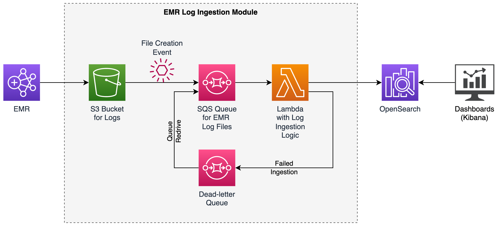

# EMR Logs in OpenSearch

This repository contains a [Terraform](https://www.terraform.io) module for ingesting [Amazon EMR](https://aws.amazon.com/emr) logs into [Amazon OpenSearch Service](https://aws.amazon.com/opensearch-service) domain within [Virtual Private Cloud (VPC)](https://aws.amazon.com/vpc).


## Background

[Amazon EMR](https://aws.amazon.com/emr/) is a cloud big data platform for running large-scale distributed data
processing jobs, interactive SQL queries, and machine learning (ML) applications using open-source analytics frameworks.

Jobs executed on EMR clusters generate various system and application logs, which EMR can store in an [S3](https://aws.amazon.com/s3/) bucket.
However, since these logs are not directly searchable in that form, exploring and analyzing such logs is not straight forward.

This repository provides a solution for ingesting EMR cluster logs into [Amazon OpenSearch Service](https://aws.amazon.com/opensearch-service/),
which provides a more convenient way to search and explore the logs, as well as represent them in the visual way (dashboards, charts, etc.).


## Architecture

The EMR Log Ingestion Module, implemented in this repository, is shown as a part of the architecture for EMR log ingestion.



During execution of jobs on EMR cluster, logs are being generated and stored in an S3 bucket.
The S3 bucket is configured to generate an event on creation of a file.
The file creation event triggers the Lambda function, which reads the log file from the bucket and submits its content to the OpenSearch service, where the logs can be further explored.


## Deployment

Prerequisites:

- `terraform` executable is available in the `PATH`. Installation instructions are [here](https://www.terraform.io/downloads.html).

- [AWS CLI](https://aws.amazon.com/cli) is installed and configured. Installation instructions are [here](https://docs.aws.amazon.com/cli/latest/userguide/cli-chap-getting-started.html).

- AWS region is set:
    ```bash
    export AWS_REGION="us-east-1"
    ```

- AWS credentials are set, which can be done in one of the following ways:

    - If the credentials are configured in the `~/.aws/credentials` file, export the `AWS_PROFILE` environment variable referencing the profile you want to use:
        ```bash
        export AWS_PROFILE="MyProfileName"
        ```

    - Otherwise, if you have access key and secret access key, you can export them directly:
        ```bash
        export AWS_ACCESS_KEY_ID=...
        export AWS_SECRET_ACCESS_KEY=...
        ```

To obtain this code and deploy it, you can [clone this repository](https://git-scm.com/docs/git-clone) to a directory of your choice.

Before deploying the module, set the name of an existing OpenSearch domain to which the logs should be ingested, by setting the value for the `opensearch_domain_name` variable in [terraform.tfvars](log-ingestion/terraform.tfvars) file.

> If you don't have an OpenSearch domain in VPC deployed yet, you can deploy one using the Terraform module implemented in our [OpenSearch in VPC](https://github.com/aws-samples/opensearch-in-vpc) example.

Once you have set the correct OpenSearch domain name, you can deploy this module by navigating to its directory:

```bash
cd log-ingestion
```

and executing following commands:

```bash
terraform init
terraform apply
```


## Usage

Once the module is deployed, you can use the created bucket as a target for EMR logs. As soon as the log files are created in this bucket, as a result of running EMR jobs, the logs will start ingesting into the OpenSearch domain.


## Cleanup

To remove the deployed resources, run:

```bash
terraform destroy
```
